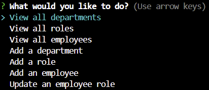
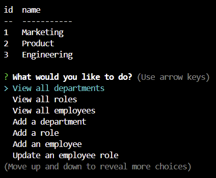
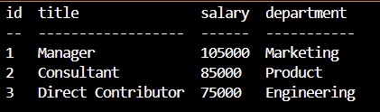
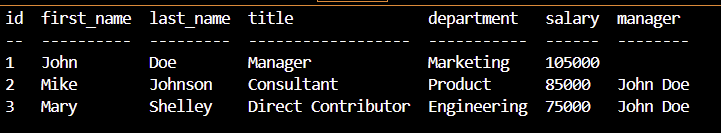

# Module 13 SQL: Employee Tracker

## Summary
In this challenge, we'll build a command line program using the Inquirer package and PostgresSQL database to serve as an employee tracking system.

## Technology
This command line program uses the following technologies to implement its various features:
1. Inquirer for implementing the user prompts, displaying a menu for choosing the CLI options, and displaying the results in a table format.

2. Postgres database for implementing the schema and creating the tables outlined in schema.sql.  Given that the program does not utilize an object relational mapper such as Sequalize, SQL queries are used instead to write and/or read the tables' data

3. The pg module, which is the PostgreSQL client for Node.js. The pg module provides various functionalities to interact with PostgreSQL databases, inclduing the capability to manage multiple client connections to the database.

## Schema
The schema has been designed to model the database for a corporation's departments, departmental roles and employees.

The following is the outline of the three tables used in the schema:

1. `department`

  * `id`: `SERIAL PRIMARY KEY`

  * `name`: `VARCHAR(30) UNIQUE NOT NULL` to hold department name

2. `role`

  * `id`: `SERIAL PRIMARY KEY`

  * `title`: `VARCHAR(30) UNIQUE NOT NULL` to hold role title

  * `salary`: `DECIMAL NOT NULL` to hold role salary

  * `department_id`: `INTEGER NOT NULL` to hold reference to department role belongs to

3. `employee`

  * `id`: `SERIAL PRIMARY KEY`

  * `first_name`: `VARCHAR(30) NOT NULL` to hold employee first name

  * `last_name`: `VARCHAR(30) NOT NULL` to hold employee last name

  * `role_id`: `INTEGER NOT NULL` to hold reference to employee role

  * `manager_id`: `INTEGER` to hold reference to another employee that is the manager of the current employee (`null` if the employee has no manager)

## Implementation
There is a one-to-one mapping between the Inquirer's menu items and the routines that are implemented to perform the SQL queries.  The following is the respective summaries:

### Summary of the inquirer user input options:
1. view all departments
2. view all roles
3. view all employees
4. add a department 
5. add a role
6. add an employee
7. update an employee role
8. Exit

### Summary of the corresponding routines
1. viewAllDepartments
  * Displays the department names and department ids

2. viewAllRoles
  * Displays the job title, role id, the department that role belongs to, and the salary for that role

3. viewAllEmployees
  * Displays the employee data, including employee ids, first names, last names, job titles, departments, salaries, and managers that the employees report to

4. addDepartment
  * The user is prompted to enter the name of the department and that department is added to the database

5. addRole
  * The user is prompted to enter the name, salary, and department for the role and that role is added to the database

6. addEmployee
  * The user is prompted to enter the employee’s first name, last name, role, and manager, and that employee is added to the database

7. updateEmployeeRole
  * The user is prompted to select an employee to update and their new role and this information is updated in the database 

## Application Setup
To provide a headstart in creating and running the Employee Tracker, sample seed data is provided to populate the aforementioned tables in the database.  To create the database and accomplish the seeding, do the following:
1. Clone the repository to your local disk
2. Open up VS Code in the project folder
3. Open up a terminal session 
4. Issue the following in the shell:
  * psql -U postgres (enter your credentials)
  * \i db/schema.sql
  * \i db/seeds.sql

The above commands recreate the database and seed its corresponding tables.

## Operation
Once the database is created and tables are seeded, the application may be started by running the following in the command shell:
* node index.js

Invoking the index.js brings up the Inquirer prompt system.  You may now use the various menu options that have been presented.  For a review of the menu options refer to the implementation section above.

A schema.sql is provided for facilitating this task.

Once the database is created, the corresponding and aforementioned models need to be seeded by running the following in the command shell:
* npm run seed

You'll notice that the seeding scripts are included in the corresponding seed definition files for each model in the database. Also notice that the database relationships between the models, such belongsTo, hasMany & belongsToMany, are defined in the index.js under the project's models folder

## Future Enhancements
The following additional menu options and queries are currently planned for the next version of this program:

* Update employee managers.

* View employees by manager.

* View employees by department.

* Delete departments, roles, and employees.

* View the total utilized budget of a department&mdash;in other words, the combined salaries of all employees in that department.

## Link to the Walkthrough Video
Use this link to view the recorded video demonstrating the execution of APIs that have been implemented to support this social network application: https://www.youtube.com/watch?v=vHg6axy3LCU

## Sample Screenshots
The following screenshots demonstrate the execution of various menu options presented by Inquirer:

